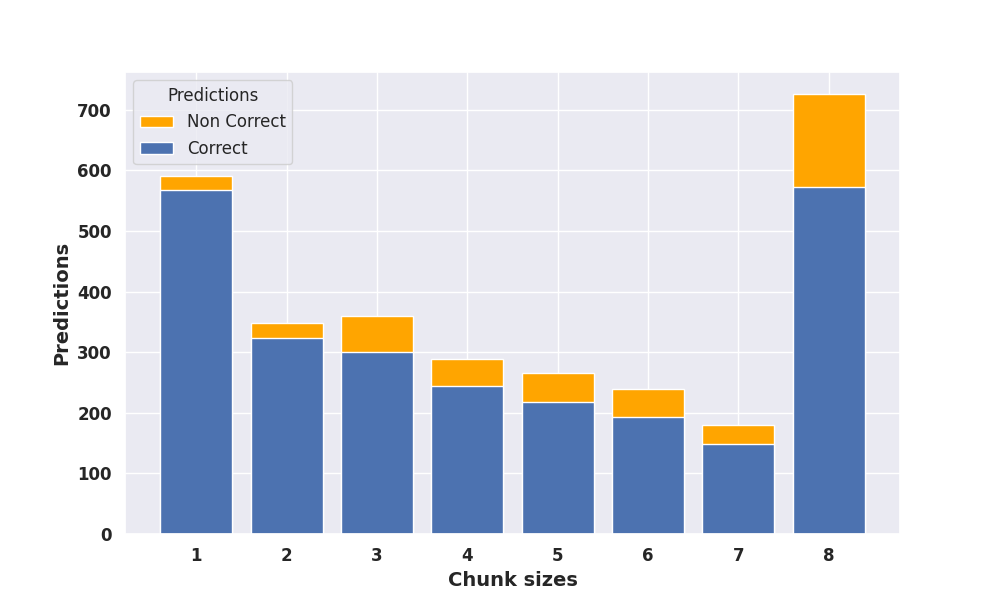

# Legal Judgement Predictor for ECHR
### Usage of LLMs embeddings in classification of legal cases from ECHR dataset


This repository contains the code and project report for the **Legal Judgment Predictor** project, which is a part of the MSc in Computer Science curriculum focused on Artificial Intelligence for the academic year 2022/2023. The project was conducted by Giacomo Lagomarsini and Leonardo Stoppani under the guidance of Prof. Giuseppe Attardi.

## Project Overview

The project aimed to address the challenge of efficiently processing long legal documents for classification tasks using advanced Natural Language Processing (NLP) techniques. Specifically, the project focused on classifying [European Court of Human Rights (ECHR)][def1] cases as either positive (if any human rights article or protocol has been violated) or negative (otherwise), which was made publicily available by the authors of the paper [Neural Legal Judgement Prediction in English][def2].

## Dataset

The dataset used in this project consists of European Court of Human Rights (ECHR) cases, sourced from publicly available legal documents. The dataset includes textual information regarding legal judgments along with corresponding labels indicating whether any human rights article or protocol has been violated (positive class) or not (negative class). 

Due to privacy and legal considerations, the dataset used in this project cannot be shared directly through this repository. However, instructions for accessing and preprocessing the dataset can be found in the project report available in the `report/` directory. 

The dataset was preprocessed to extract relevant textual features and encode them into a format suitable for training machine learning models. Various text processing techniques, including tokenization, stemming, and vectorization, were applied to prepare the dataset for model training and evaluation. 

For further details on the dataset and preprocessing steps, please refer to the project report.

## Models

The project implemented and evaluated several deep learning models for classifying ECHR cases based on textual information. The models included:

- LSTM (Long Short-Term Memory) networks
- Attention networks
- Sparse transformers
- Hierarchical transformers
- BERT (Bidirectional Encoder Representations from Transformers)

The models were trained and evaluated using the preprocessed ECHR dataset to predict whether a given legal judgment violated any human rights article or protocol. The models were evaluated based on various performance metrics, including accuracy, precision, recall, and F1 score.

For further details on the models and evaluation results, please refer to the project report.

## Repository Structure

- `src/`: This directory contains the code implementation of various models, LSTM, attention networks, sparse transformers, and hierarchical transformers.
- `ECHR_Dataset/`: This directory contains the dataset used for training and evaluation, sourced from the European Court of Human Rights (ECHR).
- `notebook/`: This directory contains Jupyter notebooks for data preprocessing, exploratory data analysis, and model training.

## Usage

To run the code and reproduce the experiments conducted in the project, follow these steps:

1. Clone the repository:

   ```bash
   git clone https://github.com/lilf4p/hlt-project.git
   ```

2. Navigate to the `src/` directory:

   ```bash
   cd hlt-project/src
   ```

3. Run the Python scripts corresponding to the models and experiments of interest.

## Dependencies

The project code requires the following dependencies:

- Python 3.x
- PyTorch
- scikit-learn
- pandas
- NumPy
- Hugging Face Transformers

Install the dependencies using `pip` and the requirements file:

```bash
pip install -r requirements.txt
```

## Contributors

- [Giacomo Lagomarsini](https://github.com/g-lago8)
- [Leonardo Stoppani](https://github.com/lilf4p)

## Acknowledgements

We express our gratitude to Prof. Giuseppe Attardi for providing the necessary hardware resources for conducting the analysis and experiments for this project.

For more details, please refer to the full project report available in the report pdf.

---
**Note:** Please ensure that you have the necessary hardware resources and dependencies installed before running the code. For any questions or issues, feel free to contact the contributors.

## References
- [Neural Legal Judgement Prediction in English][def2]
- [ECHR dataset][def1]

[def1]: https://archive.org/details/ECHR-ACL2019
[def2]: https://aclanthology.org/P19-1424.pdf
